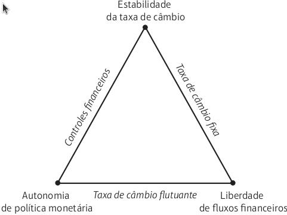
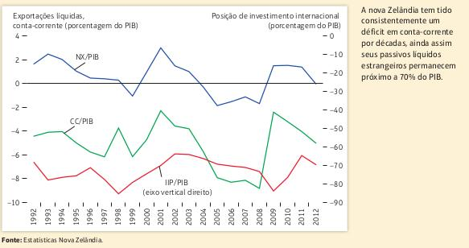

# Apresentação


## Apresentação

- Tópicos:

    1. Metas de política macroeconômica na economia aberta
    2. O trilema monetário da economia aberta
    3. Exemplo: Nova Zelândia e o eterno déficit externo
    4. Linha do tempo - Sistema Monetário Internacional


## Metas de política macroeconômica na economia aberta

<!-- Aqui a gente começa a explicar como que funciona o comportamento e objetivo dos agentes que tomam decisões no sistema monetário internacional -->

- No **equilíbrio interno**, busca-se
  - Pleno emprego dos recursos
  - Estabilidade da inflação

<!-- Alcançar o equilíbrio interno significa manter a economia operando em sua capacidade 
máxima e evitar flutuações prejudiciais nos níveis de emprego e nos preços. -->

- No **equilíbrio externo**, busca-se
  - Dívidas externas sustentáveis
  - Superávits ou déficits moderados em conta corrente

<!--  O equilíbrio externo é atingido quando a conta-corrente de um país não está em um déficit tão grande que leve o país a enfrentar problemas 
para pagar suas dívidas externas no futuro, nem em um superávit tão grande que coloque os estrangeiros em uma posição desfavorável. -->

## O trilema monetário da economia aberta

- O sistema monetário influencia na busca pelo equilíbrio interno e externo

<!-- Um sistema monetário é um conjunto de regras e arranjos que governam como a moeda de um
 país é emitida, regulamentada, valorizada e usada nas transações econômicas.-->

- No entanto, existe um **trilema** monetário inerente à estrutura de cada sistema monetário
  - Ou seja... não existe (ainda) um sistema monetário *perfeito*

## O trilema monetário da economia aberta




# Exemplo: Nova Zelândia e o eterno déficit externo

## Não há um equilíbrio externo ideal

Dívida líquida para credores estrangeiros é de 70% da sua produção nacional

Não quebra e continua captando recursos do exterior (Como?)

Resp: exportações líquidas positivas para compensar uma posição de investimento internacional negativo




# Uma visão histórica


## Linha do tempo - Sistema Monetário Internacional

```{r echo=FALSE, eval=TRUE, fig.width=10}
library(vistime)

timeline_data <- data.frame(
  event = c("Padrão-ouro (1870-1914)", "Entreguerras (1918-1939)", "Bretton-Woods(1944-1971)","Câmbio flutuante (1973-)"),
  start = as.Date(c("1870-01-01", "1918-01-01", "1944-01-01", "1973-01-01")), 
  end = as.Date(c("1914-01-01", "1939-01-01", "1971-01-01","2023-01-01")),
  tooltip = c("Origem antiga, moedas de ouro como meio de troca, unidade contábil e reserva de valor\n
              Oficial: 1819 (Parlamento Britânico)\n
              Saldo externo/mecanismo de fluxo: bancos centrais controlavam fluxo do ouro (p/ controlar câmbio moeda/ouro)\n
              Regras do jogo: BC ajustar fluxo de ouro para equilibrar balança de pagamentos.\n
              No entanto, isso não acontecia porque países superavitários e deficitários tinham incentivos diferentes p/ controlar tal fluxo\n
              Saldos internos: movimentos de preços imprevisíveis (inflação-deflação)",
              "Primeira Guerra Mundial: padrão-ouro suspenso, financiamento de despesas militares via impressão de dinheiro\n
              Consequência: níveis de preços maiores em todos os lugares pós 1918\n
              Tentativa de volta ao ouro: desastrosa. Conversão de libras p/ ouro, propagação de crise e início da Grande Depressão.\n
              Adoção da flutuação cambial em detrimento do padrão-ouro: restrições no comércio e desintegração global",
              "Criação do FMI: 44 países reunidos em New Hampshire\n
              Objetivo: estabilidade econômica e de preços via controle do fluxo de ouro via dólares (taxa de câmbio).\n
              Moeda conversível: pode ser livremente trocada por moeda estrangeira.\n
              Regras do jogo: demais paises, quatro zonas do desconforto econômico (taxa de câmbio vs. despesas domésticas)
              Regras do jogo (2):  EUA tinha uma situação peculiar (conversão ouro-dólar + sem controle do câmbio = inflação importada)
              Problemas: crises e fluxos de capitais especulativos (+ interligação financeira, + sensibilidade aos juros, + crises de balanço de pagamentos).",
              "Defesa do câmbio flutuante: + autonomia política, - assimetrias de Bretton Woods, + correção de desequilíbrios e - desequilíbrios externos\n
              Primeiros anos: ocorreu bem, mas houve teste da cooperação internacional (e.g.: Hotel Plaza 1985, desvalorização do dólar)\n
              Lição aprendida: sistemas de taxa de câmbio funcionam, quando há cooperação internacional.\n
              Lição aprendida (2): necessidade de troca de informações entre os legisladores internacionais."),
              
  group = c("Período 1", "Período 2", "Período 3", "Período 4"),
  color=c("yellow","lightgreen","lightred","lightblue")
)

vistime(timeline_data)


```


